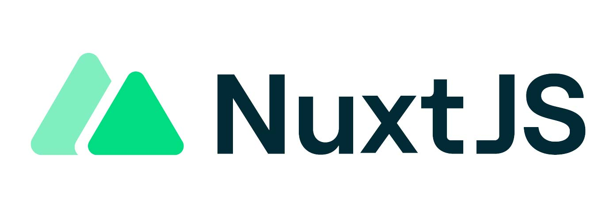

# Nuxt 3 Minimal Starter



Look at the [Nuxt 3 documentation](https://nuxt.com/docs/getting-started/introduction) to learn more.

## Setup

✨ Make sure to install the dependencies:

```bash
# npm
npm install

# pnpm
pnpm install

# yarn
yarn install

# bun
bun install
```

## Development Server

Start the development server on `http://localhost:3000`:

```bash
# npm
npm run dev

# pnpm
pnpm run dev

# yarn
yarn dev

# bun
bun run dev
```

## Production

Build the application for production:

```bash
# npm
npm run build

# pnpm
pnpm run build

# yarn
yarn build

# bun
bun run build
```

Locally preview production build:

```bash
# npm
npm run preview

# pnpm
pnpm run preview

# yarn
yarn preview

# bun
bun run preview
```

Check out the [deployment documentation](https://nuxt.com/docs/getting-started/deployment) for more information.


## Configuration

**Настройка модуля аутентификации:**

Для упрощения процесса можно использовать модуль `@sidebase/nuxt-auth`

```cmd
npm install @sidebase/nuxt-auth
```

```
nuxt-auth-app/
│
├── assets/
│   └── styles.css          # Основные стили
│
├── middleware/
│   └── auth.ts             # Middleware для защиты страниц
│
├── pages/
│   ├── login.vue           # Страница входа
│   ├── register.vue        # Страница регистрации
│   └── profile.vue         # Защищенная страница профиля
│
├── nuxt.config.ts          # Конфигурация Nuxt.js
├── package.json            # Зависимости проекта
└── app.vue                 # Корневая страница
```

**Автор:** Дуплей Максим Игоревич

**Дата:** 09.09.2024

**Версия 1.0**